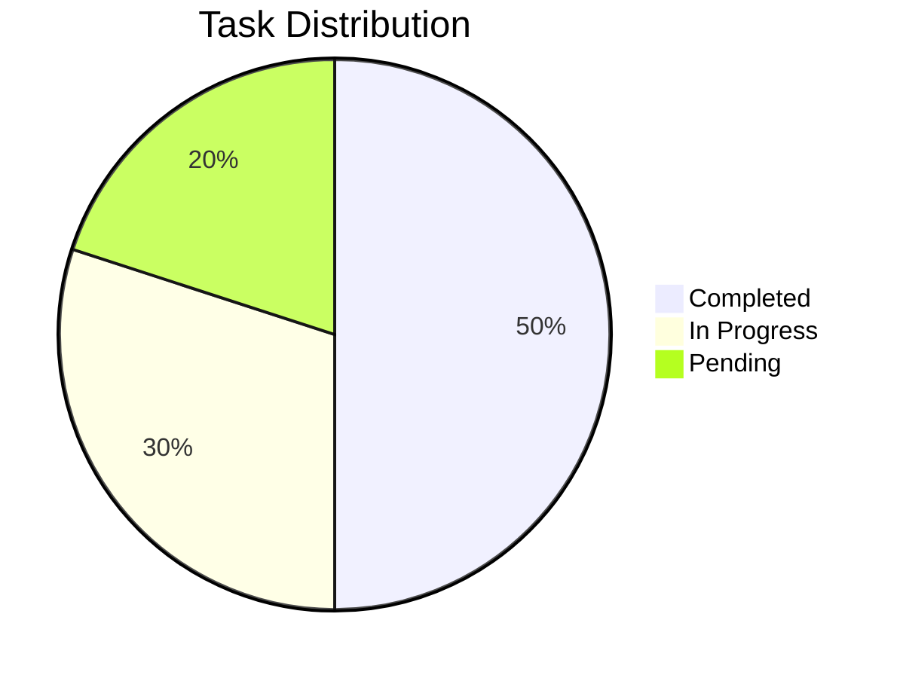

# 📄 Title of the Paper

**Author(s):**  
*Your Full Name*, Institution Name, Department  
Contact: [your.email@example.com](mailto:your.email@example.com)
*Your Full Name*, Institution Name, Department  
Contact: [your.email@example.com](mailto:your.email@example.com)
*Your Full Name*, Institution Name, Department  
Contact: [your.email@example.com](mailto:your.email@example.com)
*Your Full Name*, Institution Name, Department  
Contact: [your.email@example.com](mailto:your.email@example.com)

## 📝 Abstract

*Abstract*

## 📖 Table of Contents

1. [Introduction](#introduction)  
2. [Background and Related Work](#background-and-related-work)  
3. [Methodology](#methodology)  
4. [Results and Discussion](#results-and-discussion)  
5. [Conclusion](#conclusion)  
6. [References](#references)  


## Introduction

Introduction


## Background and Related Work

Background

## Methodology

*Describe the methods, tools, and processes used in your research.*  

## Results and Discussion

*Present and discuss your findings. Use charts, tables, or graphs for clarity.*  

| Metric      | Value     |
|-------------|-----------|
| Accuracy    | 95.3%     |
| Precision   | 92.7%     |
| Recall      | 91.4%     |

```markdown
| Metric      | Value     |
|-------------|-----------|
| Accuracy    | 95.3%     |
| Precision   | 92.7%     |
| Recall      | 91.4%     |
```



```Shell
pie
    title Task Distribution
    "Completed": 50
    "In Progress": 30
    "Pending": 20
```


## Conclusion

*Summarize the key findings of your research.*  

## 🔗 References

1. Author Name(s). *Title of Paper*. Journal Name, Year, DOI/Link.  
2. Another Author. *Title of Book*. Publisher, Year.  
3. Tool/Framework Name. [Website Link](https://example.com).  
4. Author Name(s). *Title of Paper*. Journal Name, Year, DOI/Link.
5. Another Author. *Title of Book*. Publisher, Year.
6. Tool/Framework Name. [Website Link](https://example.com).  
