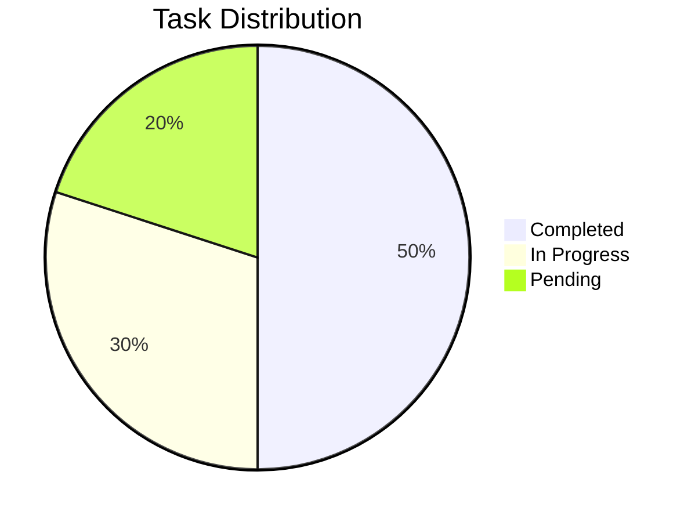
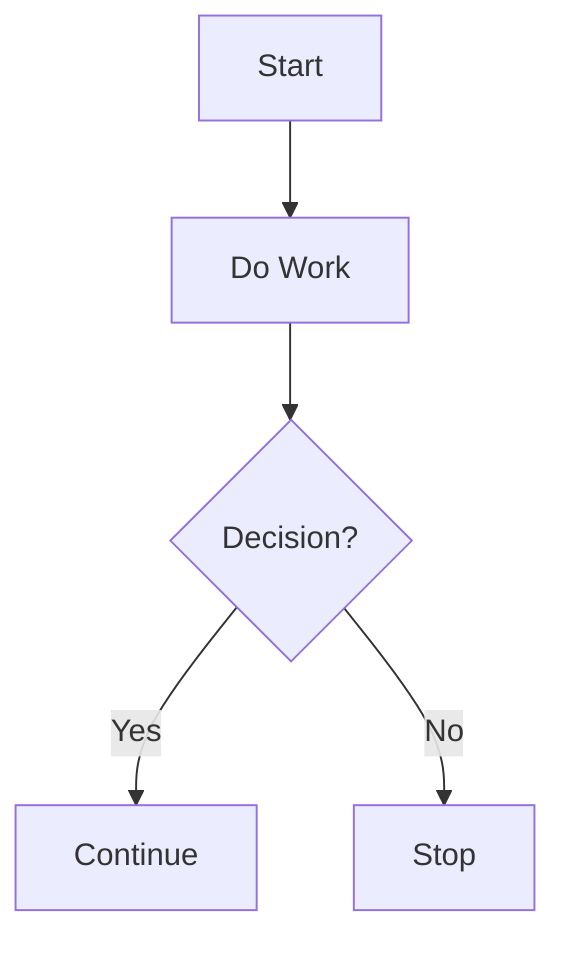

# 📊 Charts in Markdown

Markdown supports various methods to embed and display charts. Below are examples using different tools and approaches.

---

## 1️⃣ Static Chart with an Image

The simplest way to include a chart is by embedding an image link. Here's an example using **QuickChart.io**:

```markdown

```

### Result:


---

## 2️⃣ Using Mermaid.js

If your Markdown tool supports **Mermaid.js** (like GitHub Pages, MkDocs, or Docusaurus), you can create dynamic charts like pie charts, flowcharts, and more.

### Pie Chart:


### Flowchart:


---

## 3️⃣ Using HTML-based Charts (Chart.js)

For platforms that allow HTML and JavaScript (like Docusaurus or custom-rendered Markdown), you can embed interactive charts using **Chart.js**.

```html
<div style="width: 50%; margin: 0 auto;">
  <canvas id="myChart"></canvas>
</div>
<script src="https://cdn.jsdelivr.net/npm/chart.js"></script>
<script>
  const ctx = document.getElementById('myChart').getContext('2d');
  const myChart = new Chart(ctx, {
    type: 'bar',
    data: {
      labels: ['Red', 'Blue', 'Yellow', 'Green', 'Purple', 'Orange'],
      datasets: [{
        label: 'Votes',
        data: [12, 19, 3, 5, 2, 3],
        backgroundColor: [
          'rgba(255, 99, 132, 0.2)',
          'rgba(54, 162, 235, 0.2)',
          'rgba(255, 206, 86, 0.2)',
          'rgba(75, 192, 192, 0.2)',
          'rgba(153, 102, 255, 0.2)',
          'rgba(255, 159, 64, 0.2)'
        ],
        borderColor: [
          'rgba(255, 99, 132, 1)',
          'rgba(54, 162, 235, 1)',
          'rgba(255, 206, 86, 1)',
          'rgba(75, 192, 192, 1)',
          'rgba(153, 102, 255, 1)',
          'rgba(255, 159, 64, 1)'
        ],
        borderWidth: 1
      }]
    },
    options: {
      scales: {
        y: {
          beginAtZero: true
        }
      }
    }
  });
</script>
```

---

## 4️⃣ Using QuickChart.io Dynamically

Generate charts on-the-fly using QuickChart.io's URL-based API.

```markdown

```

### Result:
)

---

## 5️⃣ Using Plotly (Embed Link)

Embed interactive charts created with Plotly by using an iframe.

```html
<iframe width="600" height="400" src="https://plotly.com/~plotly_username/1.embed" frameborder="0"></iframe>
```

---

## 🔗 Resources for Charting
- [QuickChart.io](https://quickchart.io): Dynamically generate charts via URLs.
- [Mermaid.js](https://mermaid-js.github.io): Create diagrams and flowcharts in markdown.
- [Chart.js](https://www.chartjs.org): A JavaScript library for flexible charting.
- [Plotly](https://plotly.com): Interactive graphing and sharing library.

---

Choose the method that best fits your Markdown platform or project requirements! 😊
