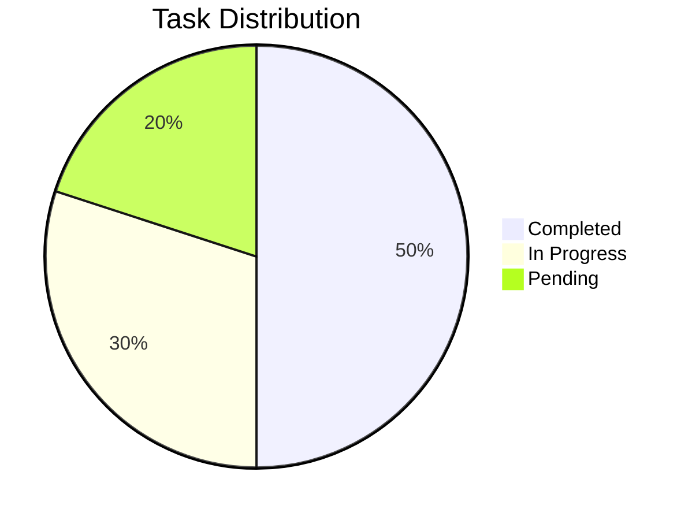
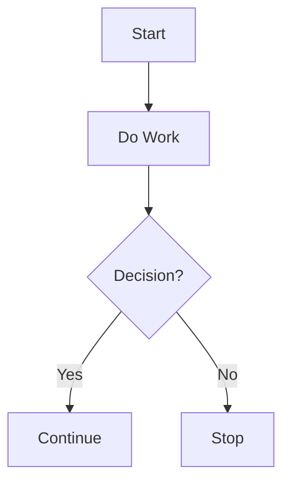

# 📊 Charts

## Using Mermaid.js

If your Markdown tool supports **Mermaid.js** (like GitHub Pages, MkDocs, or Docusaurus), you can create dynamic charts like pie charts, flowcharts, and more.

### Pie Chart:


```Shell
pie
    title Task Distribution
    "Completed": 50
    "In Progress": 30
    "Pending": 20
```
---
### Flowchart:


```Shell
graph TD
    A[Start] --> B[Do Work]
    B --> C{Decision?}
    C -->|Yes| D[Continue]
    C -->|No| E[Stop]
```
---
### Bar chart

```mermaid
gantt
    title Git Issues - days since last update
    dateFormat  X
    axisFormat %s

    section Issue19062
    71   : 0, 71
    section Issue19401
    36   : 0, 36
    section Issue193
    34   : 0, 34
    section Issue7441
    9    : 0, 9
    section Issue1300
    5    : 0, 5
```


```Shell
gantt
    title Git Issues - days since last update
    dateFormat  X
    axisFormat %s

    section Issue19062
    71   : 0, 71
    section Issue19401
    36   : 0, 36
    section Issue193
    34   : 0, 34
    section Issue7441
    9    : 0, 9
    section Issue1300
    5    : 0, 5
```


## 🙌 Acknowledgments
Find more charts here: 
* 📌 [mermaid](https://github.com/mermaid-js/mermaid)
