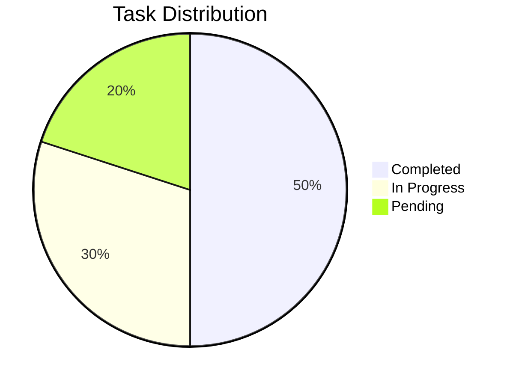
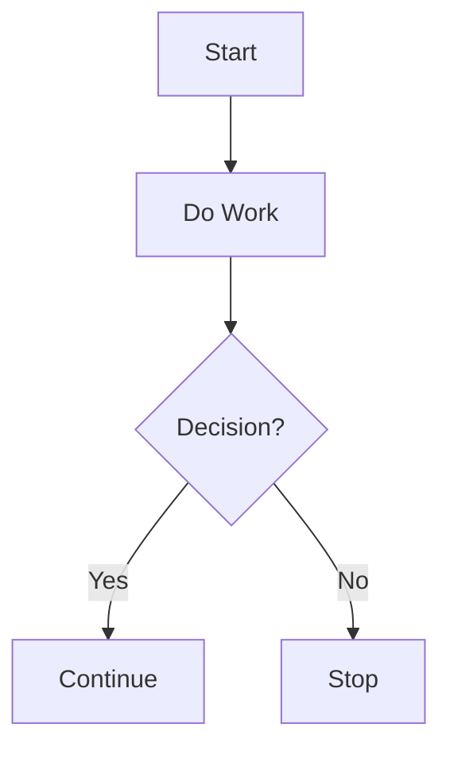

# 📊 Charts

## Using Mermaid.js

If your Markdown tool supports **Mermaid.js** (like GitHub Pages, MkDocs, or Docusaurus), you can create dynamic charts like pie charts, flowcharts, and more.

### Pie Chart:

---
### Flowchart:

## ✅ Description and Summary

A short description or Summary on Charts

## 🙌 Acknowledgments

📚 Use this space to list resources

* 📌 [Reference 1](https://example.com)
* 📌 [Reference 2](https://example.com)
* 📌 [Reference 3](https://example.com)
